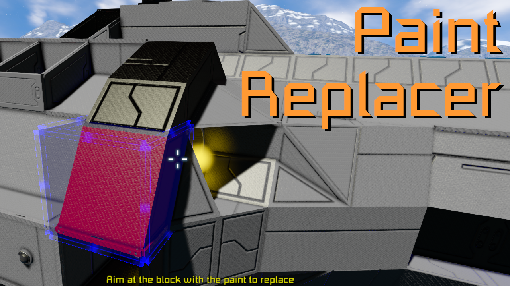
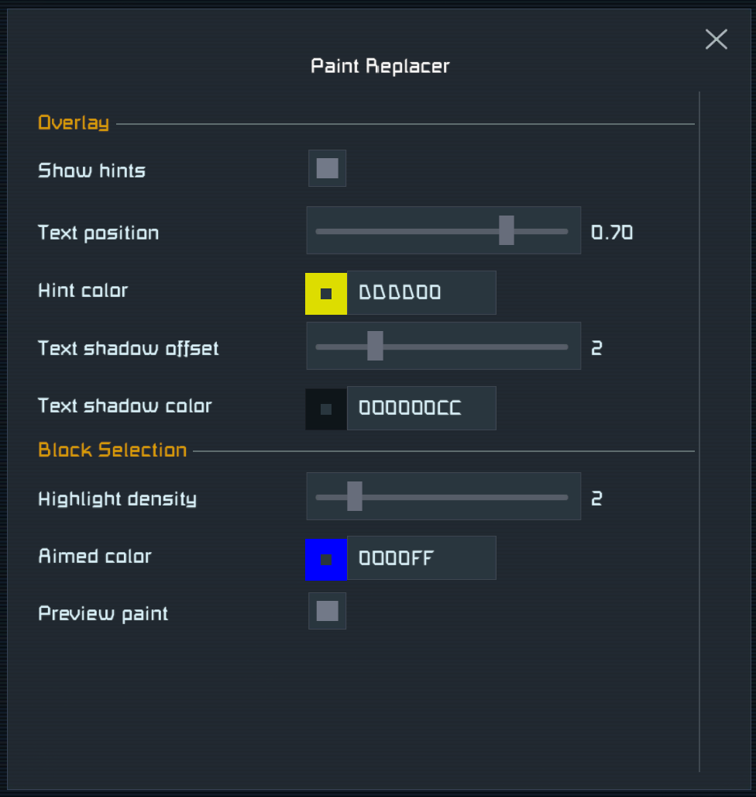

**Paint Replacer** is a **Space Engineers plugin**, which allows for **replacing a specific paint** 
(color and skin) on a ship or station. This plugin makes repainting ships way easier.

For support please [join the SE Mods Discord](https://discord.gg/PYPFPGf3Ca).

Please consider supporting my work on [Patreon](https://www.patreon.com/semods) or one time via [PayPal](https://www.paypal.com/paypalme/vferenczi/).

*Thank you and enjoy!*

## Usage

[Demo Video](https://youtu.be/8r47laAgTI8)

Activate the paint replacement mode by holding down the **Alt** key while aiming at a block.
The aiming algorithm is based on physics intersection test (raycast) for better control over
the block selection. The aimed block will be clearly highlighted.

- **Alt+MMB**: Replace the paint on the aimed subgrid.
- **Ctrl+Alt+MMB**: Replace the paint on the mechanical group (all subgrids).
- **Ctrl+Shift+Alt+MMB**: Replace the paint on the logical group (all subgrids of all connected ships).

### Remarks

The block distance from the character is the same as normal block placement in creative mode.
You can change the maximum distance of the aimed block by keeping any block at hand while
Sections is **not** active and using the `Ctrl-MouseWheel` to change the distance.

I suggest selecting no tool in hand (`0` key) while replacing colors, because it would just be in the way.

Symmetry mode is not relevant, because the replacement is based on matching the color and skin instead of block positions.

## Prerequisites

- [Space Engineers](https://store.steampowered.com/app/244850/Space_Engineers/)
- [Plugin Loader](https://github.com/sepluginloader/SpaceEngineersLauncher)

## Installation

1. Install Plugin Loader's [Space Engineers Launcher](https://github.com/sepluginloader/SpaceEngineersLauncher)
2. Run the game
3. In the **Plugins** menu add the **Sections** plugin
4. Apply and restart the game as requested

## Configuration

Press `Ctrl-Alt-/` while in-game and not in the GUI. It will open the list of
configurable plugins. Select **Paint Replacer** from the list to configure this plugin.
Alternatively you can open the settings by double-clicking on this plugin in the Plugins
dialog of Plugin Loader, then clicking **Settings** in the dialog opened.
The configuration can be changed anytime without having to restart the game.

## Known issues

- Aiming to camera blocks is not possible, it may also be the case with other blocks with a very small hitbox.
- Painting a single block is not possible, which it may be useful due to the different aiming method. 

## Legal

Space Engineers is a trademark of Keen Software House s.r.o.

## Want to know more?

- [SE Mods Discord](https://discord.gg/PYPFPGf3Ca) FAQ, Troubleshooting, Support, Bug Reports, Discussion
- [Plugin Loader Discord](https://discord.gg/6ETGRU3CzR) Everything about plugins
- [YouTube Channel](https://www.youtube.com/channel/UCc5ar3cW9qoOgdBb1FM_rxQ)
- [Source code](https://github.com/viktor-ferenczi/se-sections)
- [Bug reports](https://discord.gg/x3Z8Ug5YkQ)

## Patreon Supporters

_in alphabetical order_

#### Admiral level
- BetaMark
- Casinost
- Mordith - Guardians SE
- Robot10
- wafoxxx

#### Captain level
- Diggz
- jiringgot
- Jimbo
- Kam Solastor
- lazul
- Linux123123
- Lotan
- Lurking StarCpt
- NeonDrip
- NeVaR
- opesoorry

#### Testers
- Avaness
- mkaito

### Creators
- avaness - Plugin Loader
- Fred XVI - Racing maps
- Kamikaze - M&M mod
- LTP
- Mordith - Guardians SE
- Mike Dude - Guardians SE
- SwiftyTech - Stargate Dimensions

**Thank you very much for all your support!**