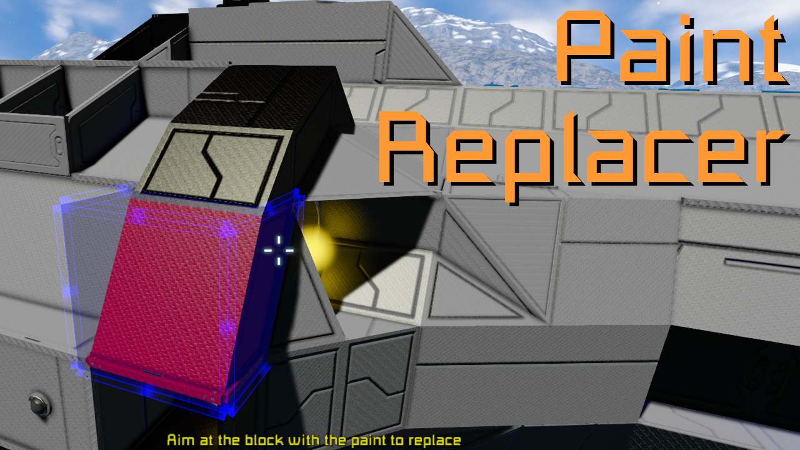
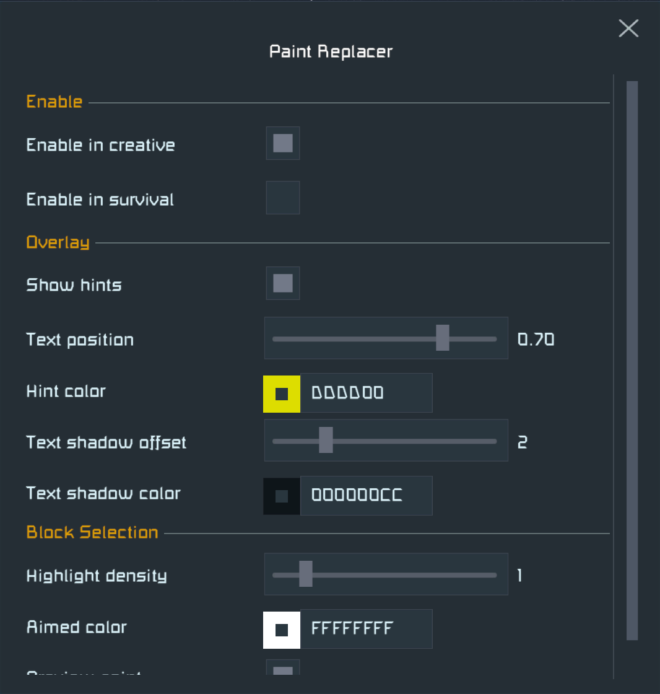

**Paint Replacer** is a **Space Engineers plugin**, which allows for **replacing a specific paint** 
(color and skin) on a ship or station. This plugin makes repainting ships way easier.

Please consider supporting my work on [Patreon](https://www.patreon.com/semods) or one time via [PayPal](https://www.paypal.com/paypalme/vferenczi/).

*Thank you and enjoy!*

## Usage

[Demo Video](https://youtu.be/8r47laAgTI8)

Activate the paint replacement mode by holding down the **modifier key** (default: **Alt**) while aiming at a block.
The aiming algorithm is based on physics intersection test (raycast) for better control over
the block selection. The aimed block will be clearly highlighted.

- **ModifierKey+MMB**: Replace the paint on the aimed subgrid.
- **Ctrl+ModifierKey+MMB**: Replace the paint on the mechanical group (all subgrids).
- **Ctrl+Shift+ModifierKey+MMB**: Replace the paint on the logical group (all subgrids of all connected ships).

The modifier key is **configurable** in the settings (see Configuration section below). By default it is **Alt**, 
but you can change it to any other key to avoid conflicts with other game functions.

### Conveyor Port Protection

By default, the plugin will **block painting when you're directly aiming at a conveyor port face** 
(like the connection face on ship connectors, cargo container ports, etc.) **in survival mode only**. 
This prevents accidental repainting when trying to dump inventory contents using the same keybind 
(Alt+MMB by default).

The protection is **face-specific**: You can paint other faces of blocks that have conveyor ports, 
just not the face with the port itself. For example, you can paint the sides of a cargo container 
without issue, but painting is blocked when aiming directly at the conveyor port face. A yellow 
warning message will appear when painting is blocked.

You can customize this behavior in the configuration:
- Allow/disallow painting over a conveyor port separately for creative and survival modes
- The default is to allow it only in creative mode, because in survival mode inventory management is more common

Alternatively, you may choose to reconfigure the modifier key to something else than the default **Alt** 
to avoid the conflicting key combination.

### Remarks

The block distance from the character is the same as normal block placement in creative mode.
You can change the maximum distance of the aimed block by keeping any block at hand while
with `Ctrl-MouseWheel` to change the distance.

I suggest selecting no tool in hand (`0` key) while replacing colors, because it would just be in the way.

Symmetry mode is not relevant, because the replacement is based on matching the color and skin instead of block positions.

## Prerequisites

- [Space Engineers](https://store.steampowered.com/app/244850/Space_Engineers/)
- [Pulsar](https://github.com/SpaceGT/Pulsar)

## Installation

1. Install Pulsar(https://github.com/StarCpt/Pulsar-Installer/releases)
2. Run the game
3. In the **Plugins** menu add the **Paint Replacer** plugin
4. Apply and restart the game as requested

## Configuration

Press `Ctrl-Alt-/` while in-game and not in the GUI. It will open the list of
configurable plugins. Select **Paint Replacer** from the list to configure this plugin.
Alternatively you can open the settings by double-clicking on this plugin in the Plugins
dialog of Pulsar, then clicking **Settings** in the dialog opened. 
The configuration can be changed anytime without having to restart the game.

## Known issues

- Aiming to camera blocks is not possible, it may also be the case with other blocks with a very small hitbox.
- Painting a single block is not possible, which it may be useful due to the different aiming method. 

## Legal

Space Engineers is a trademark of Keen Software House s.r.o.

## Want to know more?

- [Pulsar Discord](https://discord.gg/z8ZczP2YZY) Plugin discussion, support requests
- [YouTube Channel](https://www.youtube.com/channel/UCc5ar3cW9qoOgdBb1FM_rxQ)
- [Source code](https://github.com/viktor-ferenczi/se-sections)
- [Bug reports](https://discord.gg/x3Z8Ug5YkQ)

## Patreon Supporters

_in alphabetical order_

#### Admiral level
- BetaMark
- Casinost
- Mordith - Guardians SE
- Robot10
- wafoxxx

#### Captain level
- Diggz
- jiringgot
- Jimbo
- Kam Solastor
- lazul
- Linux123123
- Lotan
- Lurking StarCpt
- NeonDrip
- NeVaR
- opesoorry

#### Testers
- Avaness
- mkaito

### Creators
- Space - Pulsar
- avaness - Plugin Loader (legacy)
- Fred XVI - Racing maps
- Kamikaze - M&M mod
- LTP
- Mordith - Guardians SE
- Mike Dude - Guardians SE
- SwiftyTech - Stargate Dimensions

**Thank you very much for all your support!**